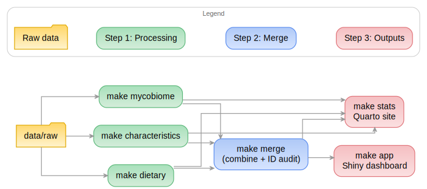
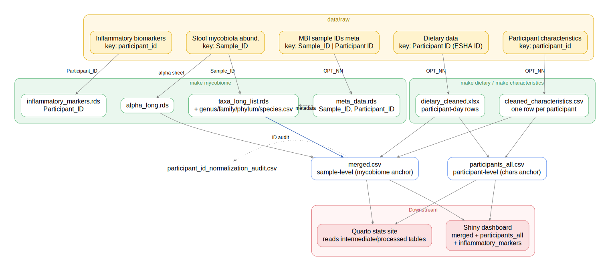

# BCCHR IBD Public Demo

This repository is a **public demo copy** of the original BCCHR IBD capstone project.

## Important note

The data used in this demo is **generated fake data**. Any outputs produced from it, including:

- dashboard content
- figures
- statistical results
- rendered Quarto pages

are **not real patient data** and should not be interpreted as real clinical findings.

## Demo links

- Stats site (GitHub Pages): [Click to view the demo stats site](https://tiffchu.github.io/BC_Childrens_Research_Institute_IBD_demo/)
- Dashboard walkthrough:  [if video fails, click here](figures/demo/dashboard_demo.mp4)

## Overview

This repository shows the structure and implementation of a reproducible pipeline for integrating clinical, dietary, biomarker, and mycobiome data into:

- cleaned analysis-ready files
- exploratory figures
- a Quarto statistical site
- a Shiny dashboard

This public version is for demonstration only. It preserves the codebase and workflow while removing private materials and replacing source data with fake generated data.

## What was removed

- private raw, intermediate, and processed data
- live credentials
- final report
- shinymanager + netlify deployment/account metadata
- private generated outputs
- local machine/cache artifacts

## Repository structure

- `src/` - analysis and pipeline code
- `dashboard/` - Shiny dashboard source
- `stats/` - Quarto analysis site source
- `docs/` - rendered stats site for GitHub Pages
- `data/` - demo input/output folders
- `figures/` - generated figures and static diagrams

## Data products

- `dashboard/` provides a Shiny app for participant-level and cohort-level exploration using demo data.
- `stats/` contains the Quarto statistical site source, and `docs/` contains the rendered public Pages copy.
- `figures/diagrams/` includes project diagrams used to explain the pipeline and data flow.

## Demo inputs

The demo uses fake generated versions of the same input workbook shapes as the original project.

| Domain | Filename |
| --- | --- |
| Mycobiome metadata | `OPT_MBI sample IDs meta.xlsx` |
| Mycobiome taxa | `OPT_stool mycobiota relative abund.xlsx` |
| Inflammatory biomarkers | `OPT_Inflammatory biomarkers.xlsx` |
| Dietary intake | `OPT_dietary data.xlsx` |
| Participant characteristics | `OPT_Participant Characteristics.xlsx` |

Place these demo workbooks in `data/raw/`.

## Workflow 





## Main workflow

The project still follows the original pipeline shape:

1. Place demo input workbooks in `data/raw/`
2. Run domain pipelines
3. Merge processed outputs
4. Render the stats site
5. Launch the dashboard

## Run the demo

From the repository root:

```sh
make setup
make mycobiome
make dietary
make characteristics
make merge
make stats
make app
```

## Notes on outputs

- `make stats` renders the Quarto site into `stats/_site/`
- `docs/` contains the GitHub Pages copy of the rendered stats site, only for this demo
- `make app` launches the Shiny dashboard using demo data in `dashboard/data/`

## Publish the stats site with GitHub Pages

1. Commit the `docs/` folder.
2. Push to your GitHub repository.
3. In GitHub, open `Settings` -> `Pages`.
4. Set the source to branch `main` and folder `/docs`.
5. Replace the placeholder stats-site URL above with your real Pages URL.

## Push to an existing empty repo

```sh
git init
git add .
git commit -m "Initial public demo release"
git branch -M main
git remote add origin <your-repo-url>
git push -u origin main
```
