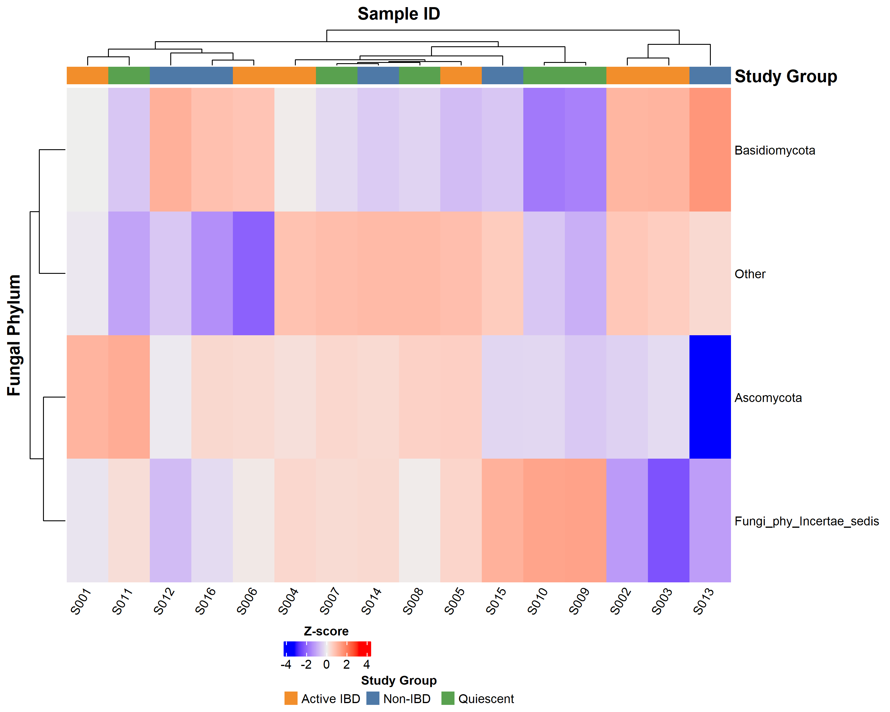
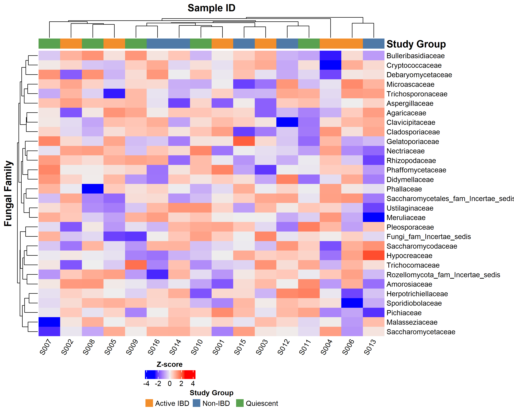
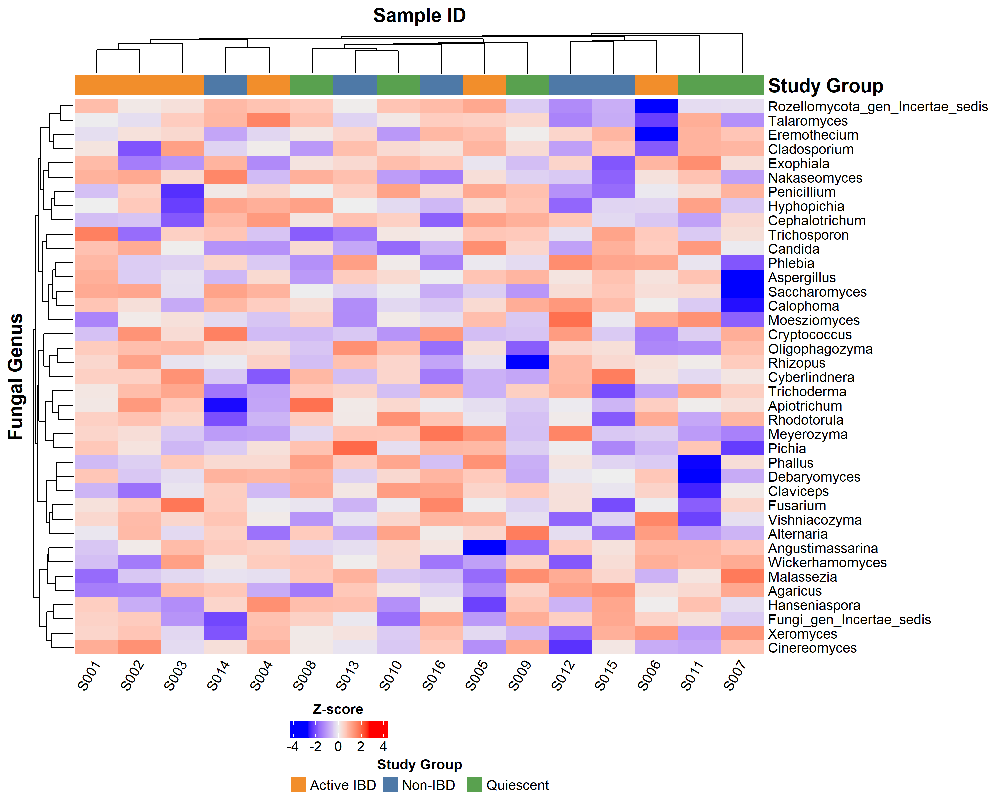
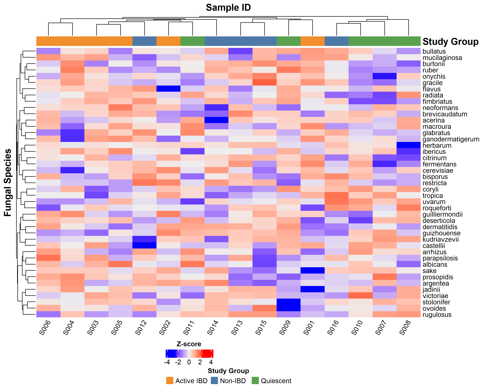

## Research question

What patterns of fungal taxonomic abundance are visible across study groups (Non-IBD, Active IBD, Quiescent)? This is a descriptive visualization — no hypothesis test or p-value is computed here.

## Data

- **Response:** Log₁₀-transformed, z-score normalized relative abundance per taxon.
- **Predictors:** Study group annotation per sample column.
- **Unit of analysis:** Sample × taxon.
- **Input files:** `data/intermediate/taxa_long_list.rds`, `data/intermediate/meta_data.rds` (from `make mycobiome`).
- **Filtering:** Taxa with zero variance, zero total abundance, or prevalence < 10 % of samples are excluded per taxonomic level.

## Methods

| Item | Choice |
|------|--------|
| Transformation | log₁₀(abundance + 1×10⁻⁶) per taxon |
| Scaling | Z-score across samples per taxon (row-wise) |
| Clustering | Hierarchical (ComplexHeatmap defaults) on both rows and columns |
| Annotation | Study group colour bar (top) |
| Package | `ComplexHeatmap` |
| Multiple testing | Not applicable — no statistical test performed |

> Figures generated by `src/mycobiome/05_heatmap_analysis.R` via `make mycobiome`.

## Figures

### Phylum

### Family

### Genus

### Species

## Interpretation

Heatmaps show relative abundance patterns across samples grouped by IBD status. Clustering of samples and taxa is driven by abundance co-variation, not by group labels — any apparent group separation is observational. Formal tests of group differences are in the PERMANOVA posts (`make stats-permanova`).
