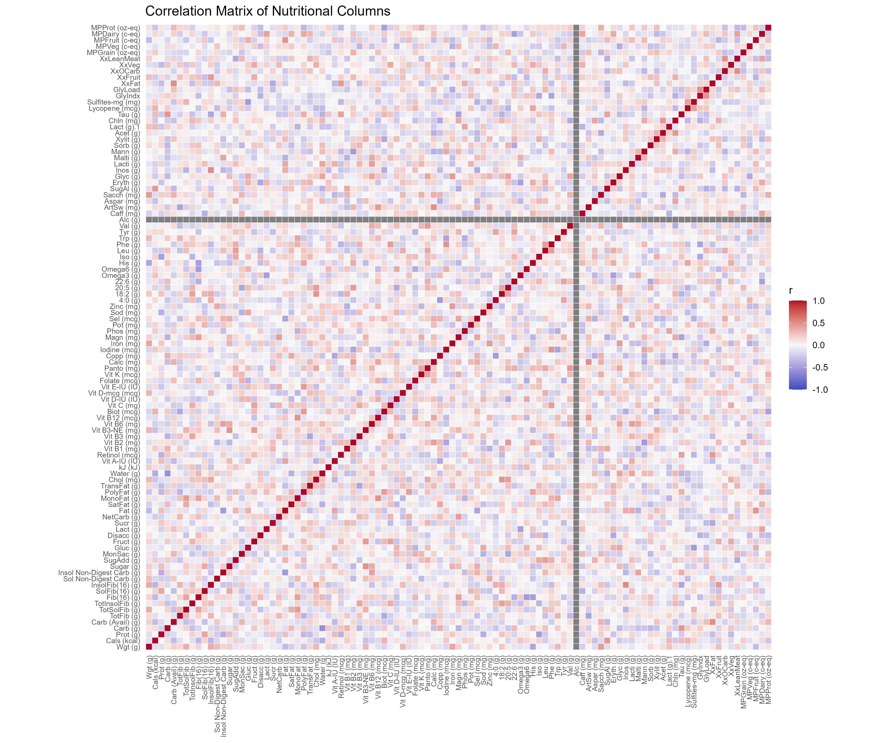
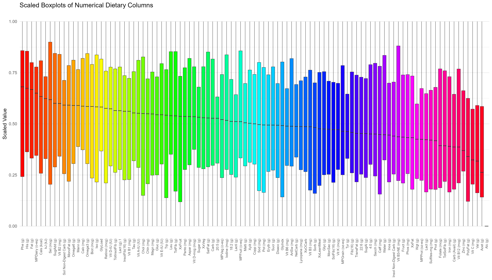
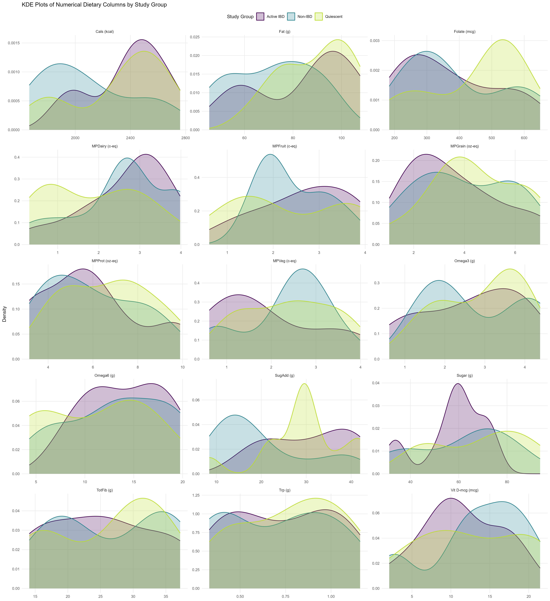
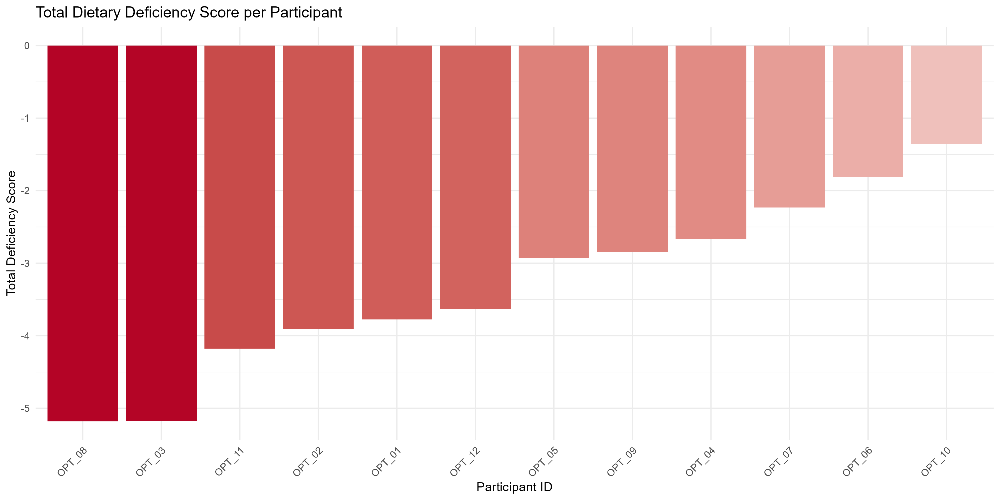

## Overview

This post collects descriptive dietary figures generated from the cleaned dietary dataset. These are exploratory visuals only: they summarize structure, spread, and cohort patterns without hypothesis testing.

> Figures generated by `src/diet/dietary.R` and the dietary EDA scripts via `make dietary`.

## Figures

### Nutrient Correlation Matrix

This heatmap shows which dietary variables tend to increase or decrease together across observations.

### Scaled Nutrient Distributions

These boxplots place dietary variables on a common 0 to 1 scale to make differences in spread and median easier to compare

### Dietary Distributions by Study Group

These kernel density plots compare the shape of dietary variable distributions across study groups.

### Total Dietary Deficiency Score per Participant

This barplot summarizes each participant's combined food group intake deficiency relative to the baseline food-group targets used in the dietary EDA workflow

## Interpretation

These figures provide a quick descriptive view of dietary structure in the cohort: correlations among nutrients, relative variability across intake measures, between-group distribution shifts, and participant-level shortfalls against baseline diet targets
