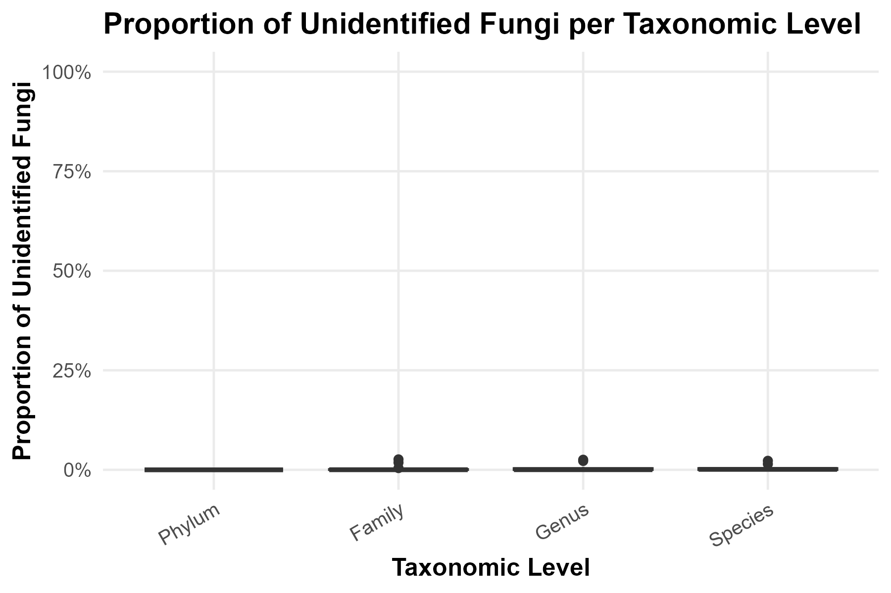
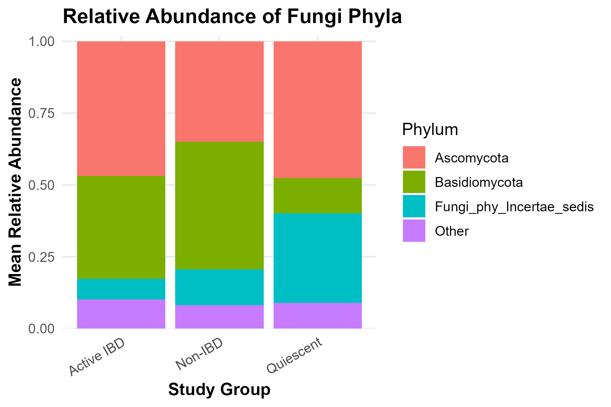
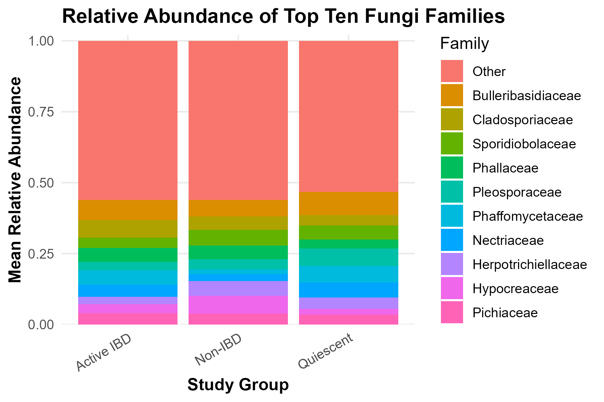
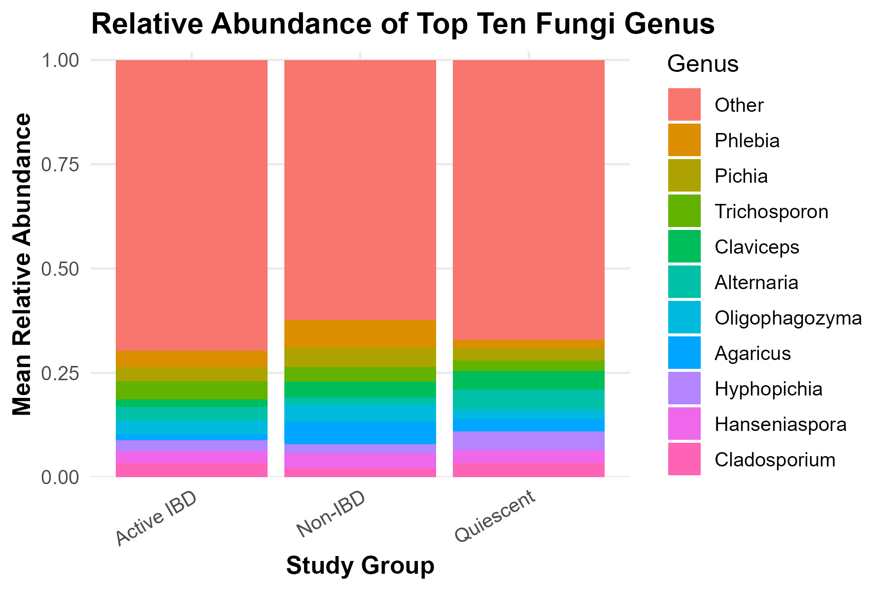
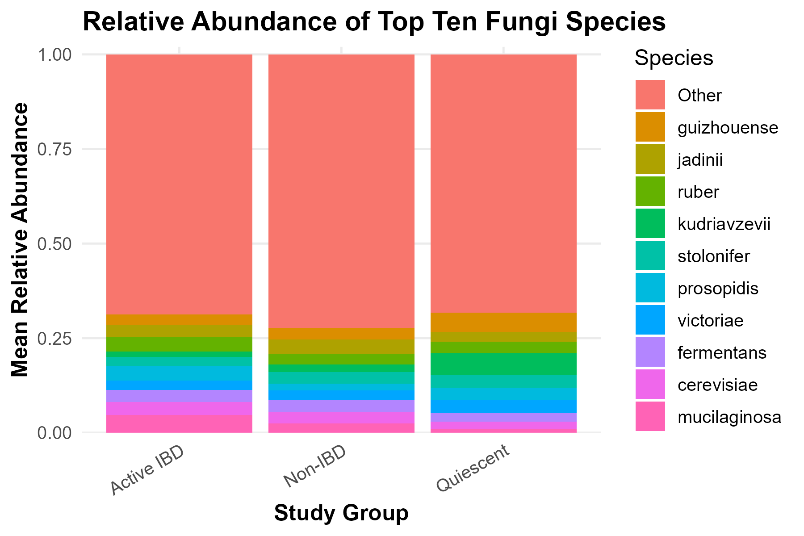

## Mycobiome Data Cleaning Process

The mycobiome metadata cleaning process involves standardizing participant metadata, including harmonizing participant IDs and attaching metadata to all microbiome datasets. Taxonomic abundance data is converted to long format, alpha diversity data is cleaned and reshaped, outlier removal is carried out on two distinct criteria as a part of both aforementioned cleaning processes. Inflammatory biomarker data are standardized by cleaning variable names, converting dates and laboratory values to appropriate formats, and flagging CRP measurements below the detection limit. The resulting cleaned datasets are then saved for subsequent analyses.

### Outlier Removal Criteria

Outlier removal consists of two criterion (only one must be met to classify an outlier): >99% of all organisms are unidentified, mycobiome diversity exceeds 1.5 * IQR.

## Proportion of Unidentified Organisms Figure

## Relative Abundance

### Phylum

### Family

### Genus

### Species

